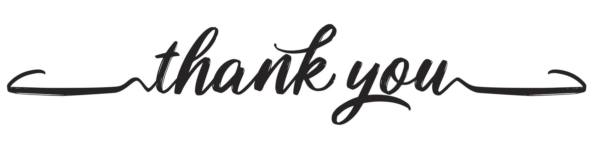

# Credits

<!-- [A big thank you to all current and past sponsors](https://github.com/photoprism/photoprism/blob/develop/SPONSORS.md), whose generous support has been and continues to be essential to the success of the project! :octicons-heart-fill-24:{ .heart .purple } -->

## Infrastructure ##

Our project infrastructure is provided by the following companies:

- [**GitHub**](https://github.com/) hosts our [code repositories](https://github.com/photoprism/photoprism) and also provides many other important services
- [**Element**](https://element.io/) develops and [operates the infrastructure](https://matrix.org/) that our [community chat](https://link.photoprism.app/chat) is based on
- [**BrowserStack**](https://www.browserstack.com/) provides [free access](https://www.browserstack.com/open-source) to their device and browser testing infrastructure

## Technologies ##

* [Go](https://golang.org/)
* [Bootstrap](https://mdbootstrap.com/) and [Material Design](https://material.io/)
* [Google](https://developers.google.com/) [TensorFlow](https://www.tensorflow.org/) and [Material Design](https://material.io/)
* [MkDocs](https://www.mkdocs.org/) and [Material for MkDocs](https://squidfunk.github.io/mkdocs-material/)
* [Photoprism](https://docs.photoprism.app/) whose documentation have greatly inspired this one.

## Artwork ##

* [Font Awesome Free](https://fontawesome.com/download) by [Fonticons, Inc.](https://fontawesome.com/)

